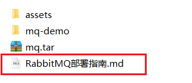
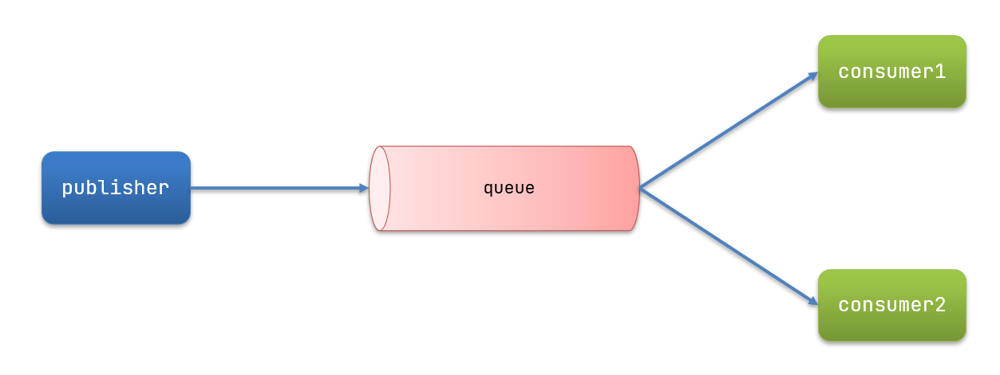
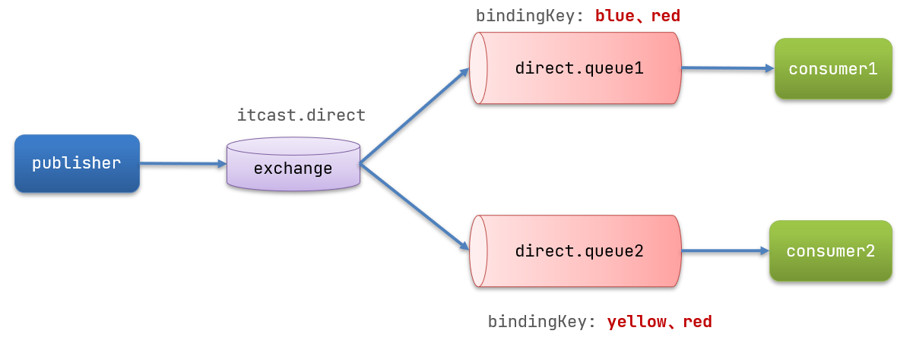
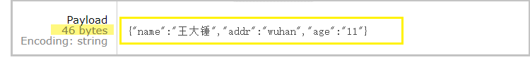

# RabbitMQ 消息队列

> 两天学习：
>
> - 今天day01:  实用为主
> - 项目2后： 高级面试点为主


# 0.学习目标

- 了解同步和异步通讯的优缺点
- 了解各种MQ技术的优缺点
- 能利用SpringAMQP收发消息
  - 能基于@Bean声明队列、交换机、绑定关系
  - 能基于@RabbitListener声明队列、交换机、绑定关系
  - 能配置SpringAMQP的消息转换器


> 带着问题学习：
>
> - 什么是MQ？
> - MQ有什么作用？


# 1.初识MQ


## 1.1 MQ简介

> MQ（Message Queue）消息队列，是一种用来保存消息数据的队列


## 1.2 MQ的作用：

==在项目中，可将一些无需即时返回且耗时的操作提取出来，进行**异步处理**，而这种异步处理的方式大大的节省了服务器的请求响应时间，从而**提高**了**系统**的**吞吐量**。==


#### MQ应用场景

1. 任务**异步**处理
2. 应用程序**解耦**
3. 削峰填谷


## 1.3.同步和异步通讯

微服务间通讯有同步和异步两种方式：

同步通讯：就像打电话，需要实时响应。

异步通讯：就像发邮件，不需要马上回复。


两种方式各有优劣，打电话可以立即得到响应，但是你却不能跟多个人同时通话。发送邮件可以同时与多个人收发邮件，但是往往响应会有延迟。


### 1.3.1.同步通讯


我们之前学习的Feign调用就属于同步方式，虽然调用可以实时得到结果，但存在下面的问题：


> **同步调用的优点：**
>
> - 时效性较强，可以立即得到结果
>
> 
>
> **同步调用的问题：**
>
> - 耦合度高
> - 性能和吞吐能力下降
> - 有额外的资源消耗
> - 有级联失败问题


### 1.3.2.异步通讯

异步调用则可以避免上述问题：


我们以购买商品为例，用户支付后需要调用订单服务完成订单状态修改，调用物流服务，从仓库分配响应的库存并准备发货。

在事件模式中，支付服务是事件发布者（publisher），在支付完成后只需要发布一个支付成功的事件（event），事件中带上订单id。

订单服务和物流服务是事件订阅者（Consumer），订阅支付成功的事件，监听到事件后完成自己业务即可。


为了解除事件发布者与订阅者之间的耦合，两者并不是直接通信，而是有一个中间人（Broker）。发布者发布事件到Broker，不关心谁来订阅事件。订阅者从Broker订阅事件，不关心谁发来的消息。


Broker 是一个像数据总线一样的东西，所有的服务要接收数据和发送数据都发到这个总线上，这个总线就像协议一样，让服务间的通讯变得标准和可控。


> **好处：**
>
> - 吞吐量提升：无需等待订阅者处理完成，响应更快速
>
> - 故障隔离：服务没有直接调用，不存在级联失败问题
> - 调用间没有阻塞，不会造成无效的资源占用
> - 耦合度极低，每个服务都可以灵活插拔，可替换
> - 流量削峰：不管发布事件的流量波动多大，都由Broker接收，订阅者可以按照自己的速度去处理事件
>
> 
>
> **缺点：**
>
> - 架构复杂了，业务没有明显的流程线，不好管理
> - 需要依赖于Broker的可靠、安全、性能
>
> 


## 1.4 MQ的优势（理解-面试）

### 1.4.1 任务**异步**处理


一个下单操作耗时：20 + 300 + 300 + 300 = 920ms

用户点击完下单按钮后，需要等待920ms才能得到下单响应，太慢！处理速度慢, 积压在系统的请求就更多 , 占用的系统资源就越多 , 系统的吞吐量就越低

可以使用MQ提升系统的处理速度 , 提供用户体验, 提升系统的吞吐量


用户点击完下单按钮后，只需等待25ms就能得到下单响应 (20 + 5 = 25ms)。

**提升用户体验和系统吞吐量（单位时间内处理请求的数目）**


### 1.4.2 应用程序解耦

假如我们完成下单的过程中 , 库存系统服务发生了问题, 调用失败, 那么用户下单操作也就失败了


**系统的耦合性越高，容错性就越低，可维护性就越低。**

可以使用MQ降低系统模块之间的耦合


使用 MQ 使得应用间解耦 , 当其他子系统发生问题之后, 并不会影响核心功能的执行 , 提升容错性和可维护性。


### 1.4.3 削峰填谷

假设平常时段我们的系统每秒最多可以处理1000个用户请求 , 但是某一时刻请求瞬间增多, 每秒有5000甚至10000个请求访问系统, 这个时候服务器承载不了就会导致服务器崩溃


使用MQ可以帮助我们规避这种风险


使用了 MQ 之后，限制消费消息的速度为1000，这样一来，高峰期产生的数据势必会被积压在 MQ 中，高峰就被“削”掉了，但是因为消息积压，在高峰期过后的一段时间内，消费消息的速度还是会维持在1000，直到消费完积压的消息，这就叫做“填谷”。


**使用MQ后，可以提高系统稳定性**


### 小结:

> - 应用解耦：提高系统容错性和可维护性
> - 异步提速：提升用户体验和系统吞吐量
> - 削峰填谷：提高系统稳定性


## 1.5 MQ技术对比：

MQ，中文是消息队列（MessageQueue），字面来看就是存放消息的队列。也就是事件驱动架构中的Broker。

比较常见的MQ实现：

- ActiveMQ
- RabbitMQ
- RocketMQ
- Kafka


**几种常见MQ的对比：**

目前业界有很多的 MQ产品，例如 RabbitMQ、RocketMQ、ActiveMQ、Kafka、ZeroMQ、MetaMq等，也有直接使用 Redis充当消息队列的案例，而这些消息队列产品，各有侧重，在实际选型时，需要结合自身需求及 MQ 产品特征，综合考虑。下面是常见MQ产品的对比


> 追求可用性：Kafka、 RocketMQ 、RabbitMQ
>
> 追求可靠性：RabbitMQ、RocketMQ
>
> 追求吞吐能力：RocketMQ、Kafka
>
> 追求消息低延迟：RabbitMQ、Kafka


# 2.快速入门

## 2.1 RabbitMQ概述

### 2.1.1 安装RabbitMQ

安装RabbitMQ，参考课前资料：




##### a. 下载镜像

方式一：在线拉取

``` sh
docker pull rabbitmq:3.8-management
```


方式二：从本地加载

在课前资料已经提供了镜像包：

 

上传到虚拟机中后，使用命令加载镜像即可：

```sh
docker load -i mq.tar
```


##### b. 安装MQ

执行下面的命令来运行MQ容器：

```sh
docker run \
 -e RABBITMQ_DEFAULT_USER=itcast \
 -e RABBITMQ_DEFAULT_PASS=123321 \
 -v mq-plugins:/plugins \
 --name mq \
 --hostname mq \
 -p 15672:15672 \
 -p 5672:5672 \
 -d \
 rabbitmq:3.8-management
```


### 2.1.2  **RabbitMQ的图形管理界面**

为了更加方便的管理RabbitMQ服务，RabbitMQ提供了一个浏览器端管理界面，可以通过浏览器页面方便的进行服务管理。

>  打开浏览器访问网站http://192.168.xx.xx:15672进入登录页面:   输入 itcast - --- 123321


> 可以在管理界面中进行 交换机、队列、用户管理等操作.


### 2.1.3 **RabbitMQ的基本结构：**


**RabbitMQ中的一些角色：**

- publisher：生产者
- consumer：消费者
- exchange个：交换机，负责消息路由
- queue：队列，存储消息
- virtualHost：虚拟主机，隔离不同租户的exchange、queue、消息的隔离


## 2.2.RabbitMQ消息模型

RabbitMQ官方`https://www.rabbitmq.com/getstarted.html`提供了5个不同的Demo示例，对应了不同的消息模型：


#### 小结：

> **RabbitMQ提供了6种模式：** 
>
> - 1.简单模式
> - 2.work模式
> - Publish/Subscribe发布与订阅模式
>   - 3.fanout 广播模式
>   - 4.Routing 路由模式 （定向模式）
>   - 5.Topics 主题模式 （通配符模式）
> - RPC远程调用模式（远程调用，不太算MQ；暂不作介绍）；


## 2.3.导入Demo工程

课前资料提供了一个Demo工程，mq-demo:


导入后可以看到结构如下：


包括三部分：

- mq-demo：父工程，管理项目依赖
- publisher：消息的发送者
- consumer：消息的消费者


## 2.4.入门案例

简单队列模式的模型图：

 

官方的HelloWorld是基于最基础的消息队列模型来实现的，只包括三个角色：

- publisher：消息发布者，将消息发送到队列queue
- queue：消息队列，负责接受并缓存消息
- consumer：订阅队列，处理队列中的消息


### 2.4.1.publisher实现

思路：

- 建立连接
- 创建Channel
- 声明队列
- 发送消息
- 关闭连接和channel


代码实现：

```java
package cn.itcast.mq.helloworld;

import com.rabbitmq.client.Channel;
import com.rabbitmq.client.Connection;
import com.rabbitmq.client.ConnectionFactory;
import org.junit.Test;

import java.io.IOException;
import java.util.concurrent.TimeoutException;

public class PublisherTest {
    @Test
    public void testSendMessage() throws IOException, TimeoutException {
        // 1.建立连接
        ConnectionFactory factory = new ConnectionFactory();
        // 1.1.设置连接参数，分别是：主机名、端口号、vhost、用户名、密码
        factory.setHost("192.168.150.101");
        factory.setPort(5672);
        factory.setVirtualHost("/");
        factory.setUsername("itcast");
        factory.setPassword("123321");
        // 1.2.建立连接
        Connection connection = factory.newConnection();

        // 2.创建通道Channel
        Channel channel = connection.createChannel();

        // 3.创建队列
        String queueName = "simple.queue";
        channel.queueDeclare(queueName, false, false, false, null);

        // 4.发送消息
        String message = "hello, rabbitmq!";
        channel.basicPublish("", queueName, null, message.getBytes());
        System.out.println("发送消息成功：【" + message + "】");

        // 5.关闭通道和连接
        channel.close();
        connection.close();

    }
}
```


### 2.4.2.consumer实现

代码思路：

- 建立连接
- 创建Channel
- 声明队列
- 订阅消息


代码实现：

```java
package cn.itcast.mq.helloworld;

import com.rabbitmq.client.*;

import java.io.IOException;
import java.util.concurrent.TimeoutException;

public class ConsumerTest {

    public static void main(String[] args) throws IOException, TimeoutException {
        // 1.建立连接
        ConnectionFactory factory = new ConnectionFactory();
        // 1.1.设置连接参数，分别是：主机名、端口号、vhost、用户名、密码
        factory.setHost("192.168.150.101");
        factory.setPort(5672);
        factory.setVirtualHost("/");
        factory.setUsername("itcast");
        factory.setPassword("123321");
        // 1.2.建立连接
        Connection connection = factory.newConnection();

        // 2.创建通道Channel
        Channel channel = connection.createChannel();

        // 3.创建队列
        String queueName = "simple.queue";
        channel.queueDeclare(queueName, false, false, false, null);

        // 4.订阅消息
        channel.basicConsume(queueName, true, new DefaultConsumer(channel){
            @Override
            public void handleDelivery(String consumerTag, Envelope envelope,
                                       AMQP.BasicProperties properties, byte[] body) throws IOException {
                // 5.处理消息
                String message = new String(body);
                System.out.println("接收到消息：【" + message + "】");
            }
        });
        System.out.println("等待接收消息。。。。");
    }
}
```


## 2.5.总结

基本消息队列的消息发送流程：

1. 建立connection

2. 创建channel

3. 利用channel声明队列

4. 利用channel向队列发送消息

基本消息队列的消息接收流程：

1. 建立connection

2. 创建channel

3. 利用channel声明队列

4. 定义consumer的消费行为handleDelivery()

5. 利用channel将消费者与队列绑定


# 3.SpringAMQP

SpringAMQP是基于RabbitMQ封装的一套模板，并且还利用SpringBoot对其实现了自动装配，使用起来非常方便。

SpringAmqp的官方地址：https://spring.io/projects/spring-amqp

<a-image src="assets/image-20210717164024967.png" alt="image-20210717164024967" style="zoom: 67%;" />

<a-image src="assets/image-20210717164038678.png" alt="image-20210717164038678" style="zoom:67%;" />


SpringAMQP提供了三个功能：

- 自动声明队列、交换机及其绑定关系
- 基于注解的监听器模式，异步接收消息
- 封装了RabbitTemplate工具，用于发送消息 


## 3.1.Basic Queue 简单队列模型

在父工程mq-demo中引入依赖

```xml
<!--AMQP依赖，包含RabbitMQ-->
<dependency>
    <groupId>org.springframework.boot</groupId>
    <artifactId>spring-boot-starter-amqp</artifactId>
</dependency>
```


### 3.1.1.消息发送

首先配置MQ地址，在publisher服务的application.yml中添加配置：

```yaml
spring:
  rabbitmq:
    host: 192.168.150.101 # 主机名
    port: 5672 # 端口
    virtual-host: / # 虚拟主机
    username: itcast # 用户名
    password: 123321 # 密码
```


然后在publisher服务中编写测试类SpringAmqpTest，并利用RabbitTemplate实现消息发送：

```java
package cn.itcast.mq.spring;

import org.junit.Test;
import org.junit.runner.RunWith;
import org.springframework.amqp.rabbit.core.RabbitTemplate;
import org.springframework.beans.factory.annotation.Autowired;
import org.springframework.boot.test.context.SpringBootTest;
import org.springframework.test.context.junit4.SpringRunner;

@RunWith(SpringRunner.class)
@SpringBootTest
public class SpringAmqpTest {

    @Autowired
    private RabbitTemplate rabbitTemplate;

    @Test
    public void testSimpleQueue() {
        // 队列名称
        String queueName = "simple.queue";
        // 消息
        String message = "hello, spring amqp!";
        // 发送消息
        rabbitTemplate.convertAndSend(queueName, message);
    }
}
```


### 3.1.2.消息接收

首先配置MQ地址，在consumer服务的application.yml中添加配置：

```yaml
spring:
  rabbitmq:
    host: 192.168.150.101 # 主机名
    port: 5672 # 端口
    virtual-host: / # 虚拟主机
    username: itcast # 用户名
    password: 123321 # 密码
```


然后在consumer服务的`cn.itcast.mq.listener`包中新建一个类SpringRabbitListener，代码如下：

```java
package cn.itcast.mq.listener;

import org.springframework.amqp.rabbit.annotation.RabbitListener;
import org.springframework.stereotype.Component;

@Component
public class SpringRabbitListener {

    @RabbitListener(queues = "simple.queue")
    public void listenSimpleQueueMessage(String msg) {
        System.out.println("spring 消费者接收到消息：【" + msg + "】");
    }
}
```


### 3.1.3.测试

启动consumer服务，然后在publisher服务中运行测试代码，发送MQ消息


### 小结：

**简单模式：**

> 实现功能： 一个生产者 P 发送消息到队列 Q，一个消费者 C 接收  （一个生产者对应一个消费者）
>
>  
>
> 在上图的模型中，有以下概念：
>
>  P：生产者 也就是要发送消息的程序
>
> C：消费者： 消息的接受者，会一直等待消息到来。
>
> queue：消息队列，图中红色部分。类似一个邮箱，可以缓存消息；生产者向其中投递消息，消费者从其中取出消息。

 

 


## 3.2.WorkQueue 工作队列模式

Work queues，也被称为（Task queues），任务模型。简单来说就是**让多个消费者绑定到一个队列，共同消费队列中的消息**。

> 一个生产者对应多个消费者,但是只能有一个消费者获得消息



当消息处理比较耗时的时候，可能生产消息的速度会远远大于消息的消费速度。长此以往，消息就会堆积越来越多，无法及时处理。

此时就可以使用work 模型，多个消费者共同处理消息处理，速度就能大大提高了。


> ***\*对比：\****
>
> Work Queues与入门程序的`简单模式`相比，多了一个或一些消费端，多个消费端共同消费同一个队列中的消息。
>
> （简单队列是一一对应的关系，即点对点，一个生产者对应一个消费者，按照这个逻辑，如果我们有一些比较耗时的任务，也就意味着需要大量的时间才能处理完毕，显然简单队列模式并不能满足我们的工作需求，因此就需要用到我们的工作队列）
>
>  
>
> ***\*应用场景：\****
>
> 对于 任务过重或任务较多情况使用工作队列可以提高任务处理的速度。


### 3.2.1.消息发送

这次我们循环发送，模拟大量消息堆积现象。

在publisher服务中的SpringAmqpTest类中添加一个测试方法：

```java
/**
     * workQueue
     * 向队列中不停发送消息，模拟消息堆积。
     */
@Test
public void testWorkQueue() throws InterruptedException {
    // 队列名称
    String queueName = "simple.queue";
    // 消息
    String message = "hello, message_";
    for (int i = 0; i < 50; i++) {
        // 发送消息
        rabbitTemplate.convertAndSend(queueName, message + i);
        Thread.sleep(20);
    }
}
```


### 3.2.2.消息接收

要模拟多个消费者绑定同一个队列，我们在consumer服务的SpringRabbitListener中添加2个新的方法：

```java
@RabbitListener(queues = "simple.queue")
public void listenWorkQueue1(String msg) throws InterruptedException {
    System.out.println("消费者1接收到消息：【" + msg + "】" + LocalTime.now());
    Thread.sleep(20);
}

@RabbitListener(queues = "simple.queue")
public void listenWorkQueue2(String msg) throws InterruptedException {
    System.err.println("消费者2........接收到消息：【" + msg + "】" + LocalTime.now());
    Thread.sleep(200);
}
```

注意到这个消费者sleep了1000秒，模拟任务耗时。


### 3.2.3.测试

启动ConsumerApplication后，在执行publisher服务中刚刚编写的发送测试方法testWorkQueue。

可以看到消费者1很快完成了自己的25条消息。消费者2却在缓慢的处理自己的25条消息。


也就是说消息是平均分配给每个消费者，并没有考虑到消费者的处理能力。这样显然是有问题的。


### 3.2.4.能者多劳

在spring中有一个简单的配置，可以解决这个问题。我们修改consumer服务的application.yml文件，添加配置：

```yaml
spring:
  rabbitmq:
    listener:
      simple:
        prefetch: 1 # 每次只能获取一条消息，处理完成才能获取下一个消息
```


### 小结：

**工作队列模式：**

- 多个消费者绑定到一个队列，同一条消息只会被一个消费者处理
- 通过设置prefetch来控制消费者预取的消息数量

**应用场景：**可以在消费者端处理任务比较耗时的时候；添加对同一个队列的消费者来提高任务处理能力。

 


 


 

 

##### **特点：**

> 在一个队列中如果有多个消费者，那么消费者之间对于同一个消息的关系是竞争的关系。
>
>  
>
> 主要解决问题：处理资源密集型任务，并且还要等他完成。有了工作队列，我们就可以将具体的工作放到后面去做，将工作封装为一个消息，发送到队列中，一个工作进程就可以取出消息并完成工作。如果启动了多个工作进程，那么工作就可以在多个进程间共享。
>
>  

 

##### 补充：

> 工作队列也称为公平性队列模式，多个消费者会对消息进行循环分发！
>
> 假如我们拥有两个消费者，默认情况下，RabbitMQ 将按顺序将每条消息发送给下一个消费者，平均而言，每个消费者将获得相同数量的消息，这种分发消息的方式称为轮询。

 

 

 

##### 注意：

> 简单模式 和 工作队列模式 都是点到点的， 一条消息，只能被一个消费者消费！
>
> 但是订阅模式，可以实现，一条消息，被多个消费者消费！

 


## 3.3.发布/订阅

发布订阅的模型如图：


可以看到，**在订阅模型中，多了一个exchange角色**，而且过程略有变化：

- Publisher：生产者，也就是要发送消息的程序，但是不再发送到队列中，而是发给X（交换机）
- Exchange：交换机，图中的X。一方面，接收生产者发送的消息。另一方面，知道如何处理消息，例如递交给某个特别队列、递交给所有队列、或是将消息丢弃。到底如何操作，取决于Exchange的类型。Exchange有以下3种类型：
  - Fanout：广播，将消息交给所有绑定到交换机的队列
  - Direct：定向，把消息交给符合指定routing key 的队列
  - Topic：通配符，把消息交给符合routing pattern（路由模式） 的队列
- Consumer：消费者，与以前一样，订阅队列，没有变化
- Queue：消息队列也与以前一样，接收消息、缓存消息。


#### 小结：

> - 在订阅模型中，多了一个exchange角色
> - **Exchange（交换机）只负责转发消息，不具备存储消息的能力**，因此如果没有任何队列与Exchange绑定，或者没有符合路由规则的队列，那么消息会丢失！
> - 交换机的三种类型.


## 3.4.Fanout 广播


在广播模式下，消息发送流程是这样的：

- 1）  可以有多个队列
- 2）  每个队列都要绑定到Exchange（交换机）
- 3）  生产者发送的消息，只能发送到交换机，交换机来决定要发给哪个队列，生产者无法决定
- 4）  交换机把消息发送给绑定过的所有队列
- 5）  订阅队列的消费者都能拿到消息


我们的计划是这样的：

- 创建一个交换机 itcast.fanout，类型是Fanout
- 创建两个队列fanout.queue1和fanout.queue2，绑定到交换机itcast.fanout


### 3.4.1.声明队列和交换机

Spring提供了一个接口Exchange，来表示所有不同类型的交换机：


在consumer中创建一个类，声明队列和交换机：

```java
package cn.itcast.mq.config;

import org.springframework.amqp.core.Binding;
import org.springframework.amqp.core.BindingBuilder;
import org.springframework.amqp.core.FanoutExchange;
import org.springframework.amqp.core.Queue;
import org.springframework.context.annotation.Bean;
import org.springframework.context.annotation.Configuration;

@Configuration
public class FanoutConfig {
    /**
     * 声明交换机
     * @return Fanout类型交换机
     */
    @Bean
    public FanoutExchange fanoutExchange(){
        return new FanoutExchange("itcast.fanout");
    }

    /**
     * 第1个队列
     */
    @Bean
    public Queue fanoutQueue1(){
        return new Queue("fanout.queue1");
    }

    /**
     * 绑定队列和交换机
     */
    @Bean
    public Binding bindingQueue1(Queue fanoutQueue1, FanoutExchange fanoutExchange){
        return BindingBuilder.bind(fanoutQueue1).to(fanoutExchange);
    }

    /**
     * 第2个队列
     */
    @Bean
    public Queue fanoutQueue2(){
        return new Queue("fanout.queue2");
    }

    /**
     * 绑定队列和交换机
     */
    @Bean
    public Binding bindingQueue2(Queue fanoutQueue2, FanoutExchange fanoutExchange){
        return BindingBuilder.bind(fanoutQueue2).to(fanoutExchange);
    }
}
```


### 3.4.2.消息发送

在publisher服务的SpringAmqpTest类中添加测试方法：

```java
@Test
public void testFanoutExchange() {
    // 队列名称
    String exchangeName = "itcast.fanout";
    // 消息
    String message = "hello, everyone!";
    rabbitTemplate.convertAndSend(exchangeName, "", message);
}
```


### 3.4.3.消息接收

在consumer服务的SpringRabbitListener中添加两个方法，作为消费者：

```java
@RabbitListener(queues = "fanout.queue1")
public void listenFanoutQueue1(String msg) {
    System.out.println("消费者1接收到Fanout消息：【" + msg + "】");
}

@RabbitListener(queues = "fanout.queue2")
public void listenFanoutQueue2(String msg) {
    System.out.println("消费者2接收到Fanout消息：【" + msg + "】");
}
```


### 小结：


> **交换机的作用是什么？**
>
> - 路由publisher发送的消息
> - 将消息按照规则路由到与之绑定的队列
> - 不能缓存消息，路由失败，消息丢失
> - FanoutExchange的会将消息路由到每个绑定的队列
>
> **声明队列、交换机、绑定关系的Bean是什么？**
>
> - Queue
> - FanoutExchange
> - Binding
>
> 


## 3.5.Direct 定向

在Fanout模式中，一条消息，会被所有订阅的队列都消费。但是，在某些场景下，我们希望不同的消息被不同的队列消费。这时就要用到Direct类型的Exchange。


 在Direct模型下：

- 队列与交换机的绑定，不能是任意绑定了，而是要指定一个`RoutingKey`（路由key）
- 消息的发送方在 向 Exchange发送消息时，也必须指定消息的 `RoutingKey`。
- Exchange不再把消息交给每一个绑定的队列，而是根据消息的`Routing Key`进行判断，只有队列的`Routingkey`与消息的 `Routing key`完全一致，才会接收到消息


**案例需求如下**：

1. 利用@RabbitListener声明Exchange、Queue、RoutingKey

2. 在consumer服务中，编写两个消费者方法，分别监听direct.queue1和direct.queue2

3. 在publisher中编写测试方法，向itcast. direct发送消息




### 3.5.1.基于注解声明队列和交换机

基于@Bean的方式声明队列和交换机比较麻烦，Spring还提供了基于注解方式来声明。

在consumer的SpringRabbitListener中添加两个消费者，同时基于注解来声明队列和交换机：

```java
@RabbitListener(bindings = @QueueBinding(
    value = @Queue(name = "direct.queue1"),
    exchange = @Exchange(name = "itcast.direct", type = ExchangeTypes.DIRECT),
    key = {"red", "blue"}
))
public void listenDirectQueue1(String msg){
    System.out.println("消费者接收到direct.queue1的消息：【" + msg + "】");
}

@RabbitListener(bindings = @QueueBinding(
    value = @Queue(name = "direct.queue2"),
    exchange = @Exchange(name = "itcast.direct", type = ExchangeTypes.DIRECT),
    key = {"red", "yellow"}
))
public void listenDirectQueue2(String msg){
    System.out.println("消费者接收到direct.queue2的消息：【" + msg + "】");
}
```


### 3.5.2.消息发送

在publisher服务的SpringAmqpTest类中添加测试方法：

```java
@Test
public void testSendDirectExchange() {
    // 交换机名称
    String exchangeName = "itcast.direct";
    // 消息
    String message = "红色警报！日本乱排核废水，导致海洋生物变异，惊现哥斯拉！";
    // 发送消息
    rabbitTemplate.convertAndSend(exchangeName, "red", message);
}
```


### 小结：

> **Direct交换机与Fanout交换机的差异？**
>
> - Fanout交换机将消息路由给每一个与之绑定的队列
> - Direct交换机根据RoutingKey判断路由给哪个队列
> - 如果多个队列具有相同的RoutingKey，则与Fanout功能类似
>
> 
>
> 基于@RabbitListener注解声明队列和交换机有哪些常见注解？
>
> - @Queue
> - @Exchange
>
> 


## 3.6  Topic  通配符

### 3.6.1.说明 

`Topic`类型的`Exchange`与`Direct`相比，都是可以根据`RoutingKey`把消息路由到不同的队列。只不过`Topic`类型`Exchange`可以让队列在绑定`Routing key` 的时候使用通配符！


`Routingkey` 一般都是有一个或多个单词组成，多个单词之间以”.”分割，例如： `item.insert`

 通配符规则：

`#`：匹配一个或多个词

`*`：匹配不多不少恰好1个词


举例：

`item.#`：能够匹配`item.spu.insert` 或者 `item.spu`

`item.*`：只能匹配`item.spu`

​     

图示：

 

解释：

- Queue1：绑定的是`china.#` ，因此凡是以 `china.`开头的`routing key` 都会被匹配到。包括china.news和china.weather
- Queue2：绑定的是`#.news` ，因此凡是以 `.news`结尾的 `routing key` 都会被匹配。包括china.news和japan.news


案例需求：

实现思路如下：

1. 并利用@RabbitListener声明Exchange、Queue、RoutingKey

2. 在consumer服务中，编写两个消费者方法，分别监听topic.queue1和topic.queue2

3. 在publisher中编写测试方法，向itcast. topic发送消息


### 3.6.2.消息发送

在publisher服务的SpringAmqpTest类中添加测试方法：

```java
/**
     * topicExchange
     */
@Test
public void testSendTopicExchange() {
    // 交换机名称
    String exchangeName = "itcast.topic";
    // 消息
    String message = "喜报！孙悟空大战哥斯拉，胜!";
    // 发送消息
    rabbitTemplate.convertAndSend(exchangeName, "china.news", message);
}
```


### 3.6.3.消息接收

在consumer服务的SpringRabbitListener中添加方法：

```java
@RabbitListener(bindings = @QueueBinding(
    value = @Queue(name = "topic.queue1"),
    exchange = @Exchange(name = "itcast.topic", type = ExchangeTypes.TOPIC),
    key = "china.#"
))
public void listenTopicQueue1(String msg){
    System.out.println("消费者接收到topic.queue1的消息：【" + msg + "】");
}

@RabbitListener(bindings = @QueueBinding(
    value = @Queue(name = "topic.queue2"),
    exchange = @Exchange(name = "itcast.topic", type = ExchangeTypes.TOPIC),
    key = "#.news"
))
public void listenTopicQueue2(String msg){
    System.out.println("消费者接收到topic.queue2的消息：【" + msg + "】");
}
```


### 小结：

> **描述下Direct交换机与Topic交换机的差异？**
>
> - **相同点：**都是可以根据 RoutingKey 把消息路由到不同的队列。 
> - **不同点：** Topic在配置routing key 的时候可以使用通配符，显得更加灵活。
>
> - Topic交换机接收的消息RoutingKey必须是多个单词，以 `.` 分割
> - Topic 类型与 Direct 相比，都是可以根据 RoutingKey 把消息路由到不同的队列。只不过 Topic 类型 Exchange 可以让队列在绑定 Routing key 的时候使用通配符！
>   - `#`：代表0个或多个词
>   - `*`：代表1个词
>
>
> 
>
> **举例：**
>
> item.# ：能够匹配 item.aa.bb或者  item.aa
>
> item.* ：只能匹配 item.aa


 


## 3.7.消息转换器

之前说过，Spring会把你发送的消息序列化为字节发送给MQ，接收消息的时候，还会把字节反序列化为Java对象。


只不过，默认情况下Spring采用的序列化方式是JDK序列化。众所周知，JDK序列化存在下列问题：

- 数据体积过大
- 有安全漏洞
- 可读性差

我们来测试一下。


### 3.7.1.测试默认转换器


我们修改消息发送的代码，发送一个Map对象：

```java
@Test
public void testSendMap() throws InterruptedException {
    // 准备消息
    Map<String,Object> msg = new HashMap<>();
    msg.put("name", "Jack");
    msg.put("age", 21);
    // 发送消息
    rabbitTemplate.convertAndSend("simple.queue","", msg);
}
```


停止consumer服务


发送消息后查看控制台：


### 3.7.2.配置JSON转换器

显然，JDK序列化方式并不合适。我们希望消息体的体积更小、可读性更高，因此可以使用JSON方式来做序列化和反序列化。

在publisher和consumer两个服务中都引入依赖：

```xml
<dependency>
    <groupId>com.fasterxml.jackson.dataformat</groupId>
    <artifactId>jackson-dataformat-xml</artifactId>
    <version>2.9.10</version>
</dependency>
```

配置消息转换器。

在启动类中添加一个Bean即可：

```java
@Bean
public MessageConverter jsonMessageConverter(){
    return new Jackson2JsonMessageConverter();
}
```


### 3.7.3.消息发送

```java
@Test
public void testSendMap() throws InterruptedException {
    // 准备消息
    Map<String,Object> msg = new HashMap<>();
    msg.put("name", "Jack");
    msg.put("age", 21);
    // 发送消息
    rabbitTemplate.convertAndSend("simple.queue","", msg);
}
```


### 3.7.4.消息接收

```java
    @RabbitListener(queues = "object.queue")
    public void listenObjectQueue(Map<String,Object> msg){
        System.out.println("接收到object.queue的消息：" + msg);
    }
```





> 解决JDK序列化的下列问题：
>
> - 数据体积过大
> - 有安全漏洞
> - 可读性差


# **模式总结**

**五种模式，可以分为两大类：**

> **不直接Exchange交换机（默认交换机）：**
>
>  	1. simple简单模式：一个生产者生产一个消息到一个队列被一个消费者接收
> 	
>  	2. work工作队列模式：生产者发送消息到一个队列中，然后可以被多个消费者监听该队列；一个消息只能被一个消费者接收，消费者之间是竞争关系
>
>  
>
> **使用Exchange交换机；订阅模式（交换机：广播fanout、定向direct、通配符topic）**
>
>  	1. 广播模式：使用了fanout广播类型的交换机，可以将一个消息发送到所有绑定了该交换机的队列
> 	
>  	2. 路由模式：使用了direct定向类型的交换机，消费会携带路由key，交换机根据消息的路由key与队列的路由key进行对比，一致的话那么该队列可以接收到消息
> 	
>  	3. 通配符模式：使用了topic通配符类型的交换机，消费会携带路由key（*， #），交换机根据消息的路由key与队列的路由key进行对比，匹配的话那么该队列可以接收到消息
>
> 
