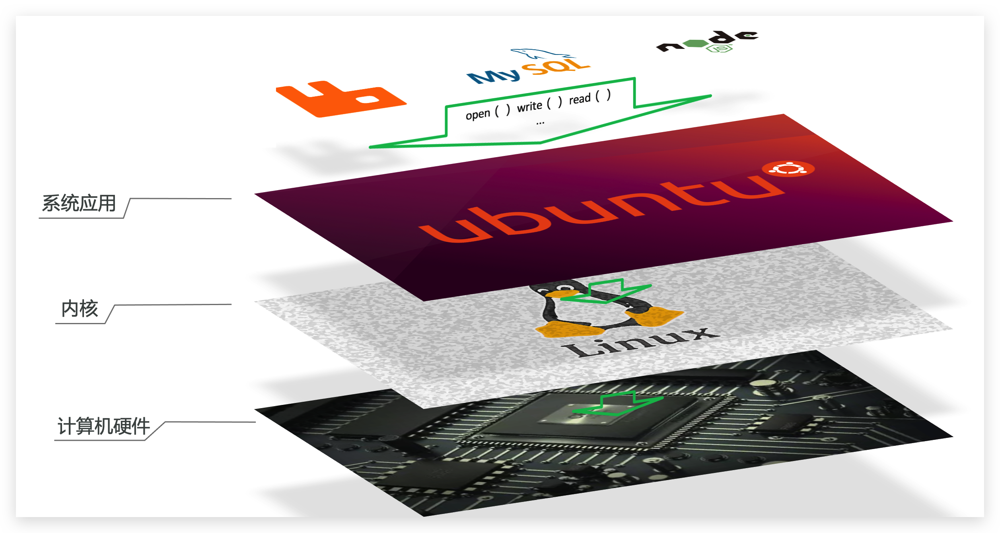
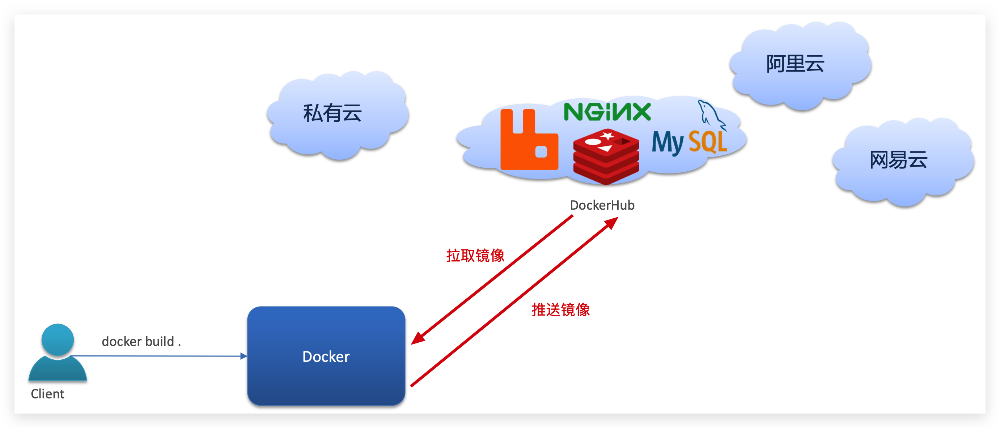
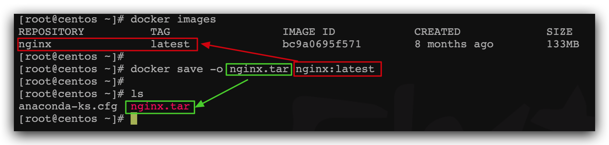
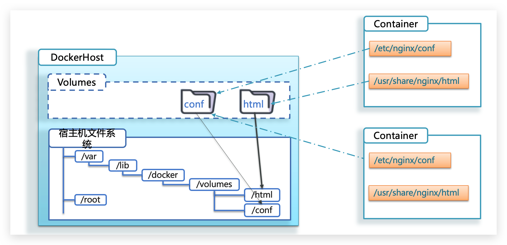
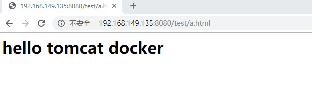
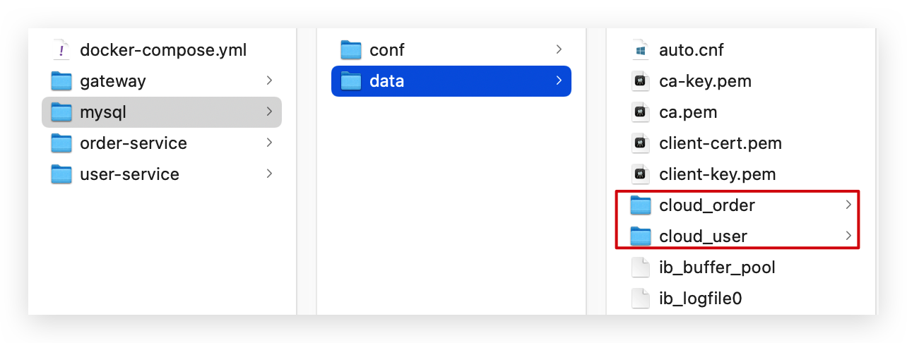

# Docker-容器化技术

> 统一运行环境（运维的范畴）


# 0.学习目标

- 了解Docker和虚拟机的差别
- 能利用Docker命令操作镜像
- 能利用Docker命令操作容器
- 能操作容器的数据卷


# 1.初识Docker

## 1.1.什么是Docker

微服务虽然具备各种各样的优势，但服务的拆分通用给部署带来了很大的麻烦。

- 分布式系统中，依赖的组件非常多，不同组件之间部署时往往会产生一些冲突。
- 在数百上千台服务中重复部署，环境不一定一致，会遇到各种问题


### 1.1.1.应用部署的环境问题

大型项目组件较多，运行环境也较为复杂，部署时会碰到一些问题：

- 依赖关系复杂，容易出现兼容性问题

- 开发、测试、生产环境有差异


例如一个项目中，部署时需要依赖于node.js、Redis、RabbitMQ、MySQL等，这些服务部署时所需要的函数库、依赖项各不相同，甚至会有冲突。给部署带来了极大的困难。


### 1.1.2.Docker解决依赖兼容问题

而Docker确巧妙的解决了这些问题，Docker是如何实现的呢？

Docker为了解决依赖的兼容问题的，采用了两个手段：

- 将应用的Libs（函数库）、Deps（依赖）、配置与应用一起打包

- 将每个应用放到一个隔离**容器**去运行，避免互相干扰


这样打包好的应用包中，既包含应用本身，也保护应用所需要的Libs、Deps，无需再操作系统上安装这些，自然就不存在不同应用之间的兼容问题了。


虽然解决了不同应用的兼容问题，但是开发、测试等环境会存在差异，操作系统版本也会有差异，怎么解决这些问题呢？


### 1.1.3.Docker解决 

要解决不同操作系统环境差异问题，必须先了解操作系统结构。以一个Ubuntu操作系统为例，结构如下：




结构包括：

- 计算机硬件：例如CPU、内存、磁盘等
- 系统内核：所有Linux发行版的内核都是Linux，例如CentOS、Ubuntu、Fedora等。内核可以与计算机硬件交互，对外提供**内核指令**，用于操作计算机硬件。
- 系统应用：操作系统本身提供的应用、函数库。这些函数库是对内核指令的封装，使用更加方便。


应用于计算机交互的流程如下：

1）应用调用操作系统应用（函数库），实现各种功能

2）系统函数库是对内核指令集的封装，会调用内核指令

3）内核指令操作计算机硬件


Ubuntu和CentOS 都是基于Linux内核，无非是系统应用不同，提供的函数库有差异：


此时，如果将一个Ubuntu版本的MySQL应用安装到CentOS系统，MySQL在调用Ubuntu函数库时，会发现找不到或者不匹配，就会报错了：


**Docker如何解决不同系统环境的问题？**

- Docker将用户程序与所需要调用的系统(比如Ubuntu)函数库一起打包
- Docker运行到不同操作系统时，直接基于打包的函数库，借助于操作系统的Linux内核来运行

如图：


#### 小结:

> Docker如何解决大型项目依赖关系复杂，不同组件依赖的兼容性问题？
>
> - Docker允许开发中将应用、依赖、函数库、配置一起**打包**，形成可移植镜像
> - Docker应用运行在容器中，使用沙箱机制，相互**隔离**
>
> 
>
> Docker如何解决开发、测试、生产环境有差异的问题？
>
> - Docker镜像中包含完整运行环境，包括系统函数库，仅依赖系统的Linux内核，因此可以在任意Linux操作系统上运行
>
> 
>
> Docker是一个快速交付应用、运行应用的技术，具备下列优势：
>
> - 可以将程序及其依赖、运行环境一起打包为一个镜像，可以迁移到任意Linux操作系统
> - 运行时利用沙箱机制形成隔离容器，各个应用互不干扰
> - 启动、移除都可以通过一行命令完成，方便快捷
>


## 1.2.Docker和虚拟机的区别

Docker可以让一个应用在任何操作系统中非常方便的运行。而以前我们接触的虚拟机，也能在一个操作系统中，运行另外一个操作系统，保护系统中的任何应用。


两者有什么差异呢？


**虚拟机**（virtual machine）是在操作系统中**模拟**硬件设备，然后运行另一个操作系统，比如在 Windows 系统里面运行 Ubuntu 系统，这样就可以运行任意的Ubuntu应用了。

**Docker**仅仅是封装函数库，并没有模拟完整的操作系统，如图：


<a-image src="assets/image-20210731145914960.png" alt="image-20210731145914960" style="zoom: 33%;" />

对比来看：

<a-image src="assets/image-20210731152243765.png" alt="image-20210731152243765" style="zoom: 33%;" />


#### 小结：

> Docker和虚拟机的差异：
>
> - docker是一个系统进程；           虚拟机是在操作系统中的操作系统
>
> - docker体积小、启动速度快、性能好；          虚拟机体积大、启动速度慢、性能一般
>


## 1.3.Docker架构


### 1.3.1.镜像和容器

Docker中有几个重要的概念：

**镜像（Image）**：Docker将应用程序及其所需的依赖、函数库、环境、配置等文件打包在一起，称为镜像。

**容器（Container）**：镜像中的应用程序运行后形成的进程就是**容器**，只是Docker会给容器进程做隔离，对外不可见。


一切应用最终都是代码组成，都是硬盘中的一个个的字节形成的**文件**。只有运行时，才会加载到内存，形成进程。


而**镜像**，就是把一个应用在硬盘上的文件、及其运行环境、部分系统函数库文件一起打包形成的文件包。这个文件包是只读的。

**容器**呢，就是将这些文件中编写的程序、函数加载到内存中允许，形成进程，只不过要隔离起来。因此一个镜像可以启动多次，形成多个容器进程。


例如你下载了一个QQ，如果我们将QQ在磁盘上的运行**文件**及其运行的操作系统依赖打包，形成QQ镜像。然后你可以启动多次，双开、甚至三开QQ，跟多个妹子聊天。


### 1.3.2.DockerHub

开源应用程序非常多，打包这些应用往往是重复的劳动。为了避免这些重复劳动，人们就会将自己打包的应用镜像，例如Redis、MySQL镜像放到网络上，共享使用，就像GitHub的代码共享一样。

- DockerHub：DockerHub是一个官方的Docker镜像的托管平台。这样的平台称为Docker Registry。

- 国内也有类似于DockerHub 的公开服务，比如 [网易云镜像服务](https://c.163yun.com/hub)、[阿里云镜像库](https://cr.console.aliyun.com/)等。


我们一方面可以将自己的镜像共享到DockerHub，另一方面也可以从DockerHub拉取镜像：




### 1.3.3.Docker架构

我们要使用Docker来操作镜像、容器，就必须要安装Docker。

Docker是一个CS架构的程序，由两部分组成：

- 服务端(server)：Docker守护进程，负责处理Docker指令，管理镜像、容器等

- 客户端(client)：通过命令或RestAPI向Docker服务端发送指令。可以在本地或远程向服务端发送指令。


如图：


### 1.3.4.小结


> **镜像：**
>
> - 将应用程序及其依赖、环境、配置打包在一起
>
> **容器：**
>
> - 镜像运行起来就是容器，一个镜像可以运行多个容器
>
> **Docker架构：**
>
> - 服务端：接收命令或远程请求，操作镜像或容器
> - 客户端：发送命令或者请求到Docker服务端
>
> 
>
> **DockerHub：**
>
> - 一个镜像托管的服务器，类似的还有阿里云镜像服务，统称为DockerRegistry
>
> 


> docker是一个统一运行环境的容器！


## 1.4.安装Docker

> 挂载我给的虚拟机即可！

企业部署一般都是采用Linux操作系统，而其中又数CentOS发行版占比最多，因此我们在CentOS下安装Docker。参考课前资料中的文档：


# 2.Docker的基本操作


## 2.0 Docker服务相关命令【掌握】

```sh
# 查看服务状态：
systemctl status docker

# 启动docker服务：
systemctl start docker

# 停止docker服务
systemctl stop docker

# 重启docker服务
systemctl restart docker
```


## 2.1.镜像操作【掌握】


### 2.1.1.镜像名称

首先来看下镜像的名称组成：

- 镜名称一般分两部分组成：[repository]:[tag]。
- 在没有指定tag时，默认是latest，代表最新版本的镜像

如图：


这里的mysql就是repository，5.7就是tag，合一起就是镜像名称，代表5.7版本的MySQL镜像。


### 2.1.2.镜像命令

常见的镜像操作命令如图：


### 2.1.3.案例1-拉取、查看镜像

需求：从DockerHub中拉取一个nginx镜像并查看

1）首先去镜像仓库搜索nginx镜像，比如[DockerHub](https://hub.docker.com/):


2）根据查看到的镜像名称，拉取自己需要的镜像，通过命令：docker pull nginx


3）通过命令：docker images 查看拉取到的镜像


### 2.1.4.案例2-保存、导入镜像

需求：利用docker save将nginx镜像导出磁盘，然后再通过load加载回来

1）利用docker xx --help命令查看docker save和docker load的语法

例如，查看save命令用法，可以输入命令：

```sh
docker save --help
```

结果：


命令格式：

```shell
docker save -o [保存的目标文件名称] [镜像名称]
```


2）使用docker save导出镜像到磁盘 

运行命令：

```sh
docker save -o nginx.tar nginx:latest
```

结果如图：




3）使用docker load加载镜像

先删除本地的nginx镜像：

```sh
docker rmi nginx:latest
```


然后运行命令，加载本地文件：

```sh
docker load -i nginx.tar
```

结果：


### 2.1.5.练习

**需求：去DockerHub搜索并拉取一个Redis镜像**

目标：

1）去DockerHub搜索Redis镜像

2）查看Redis镜像的名称和版本

3）利用docker pull命令拉取镜像

4）利用docker save命令将 redis:latest打包为一个redis.tar包

5）利用docker rmi 删除本地的redis:latest

6）利用docker load 重新加载 redis.tar文件


### 小结：（镜像相关命令）

```sh
# 1.查看 镜像：   ---> 查看的是本地镜像
docker images
docker images -q 镜像名   # 查看一个

# 2. 搜索镜像：   ---> 搜索的是远程注册中心（仓库）的镜像
docker search mysql
docker search 镜像名

# 3. 拉取镜像： （从注册中心 下载镜像到本地）
docker pull mysql
docker pull 镜像名

# 4. 删除镜像： (先查询 再删除)
docker rmi 镜像名（或者镜像id）
docker rmi mysql
docker rmi `docker images -q mysql`

# 5. 导出镜像到磁盘 
docker save -o 文件名 镜像名:tag版本
docker save -o nginx.tar nginx:latest

# 6. 加载镜像
docker load -i 文件名
docker load -i nginx.tar
```


## 2.2.容器操作【掌握】


### 2.2.1.容器相关命令

容器操作的命令如图：


容器保护三个状态：

- 运行：进程正常运行
- 暂停：进程暂停，CPU不再运行，并不释放内存
- 停止：进程终止，回收进程占用的内存、CPU等资源


其中：

- docker run：创建并运行一个容器，处于运行状态
- docker pause：让一个运行的容器暂停
- docker unpause：让一个容器从暂停状态恢复运行
- docker stop：停止一个运行的容器
- docker start：让一个停止的容器再次运行

- docker rm：删除一个容器


### 2.2.2 查看容器

~~~shell
docker ps # 查看正在运行的容器
docker ps –a # 查看所有容器，包括正在运行和停止的容器
~~~


### 2.2.3 创建并启动容器

~~~shell
docker run 参数
~~~

**参数说明：**

• -i：保持容器运行。通常与 -t 同时使用。加入it这两个参数后，容器创建后自动进入容器中，退出容器后，容器自动关闭。 

• -t：为容器重新分配一个伪输入终端，通常与 -i 同时使用。 

• -d：以守护（后台）模式运行容器。创建一个容器在后台运行，需要使用docker exec 进入容器。退出后，容器不会关闭。 

• -it 创建的容器一般称为交互式容器，-id 创建的容器一般称为守护式容器 

• --name：为创建的容器命名。


**1）交互式容器** 

以**交互式**方式创建并启动容器，启动完成后，直接进入当前容器。使用exit命令退出容器。需要注意的是以此种方式 启动容器，如果退出容器，则容器会进入**停止**状态。 

~~~shell
# 先拉取一个镜像；这一步不是每次启动容器都要做的，而是因为前面我们删除了镜像，无镜像可用所以才再拉取一个 
docker pull centos:7 

#创建并启动名称为 mycentos7 的交互式容器；下面指令中的镜像名称 centos:7 也可以使用镜像id 
docker run -it --name=mycentos7 centos:7 /bin/bash
~~~


**2）守护式容器**

创建一个守护式容器；如果对于一个需要长期运行的容器来说，我们可以创建一个守护式容器。命令如下（容器名称 不能重复）：

~~~shell
#创建并启动守护式容器
docker run -id --name=mycentos2 centos:7

#登录进入容器命令为：docker exec -it container_name (或者 container_id) /bin/bash（exit退出 时，容器不会停止）
docker exec -it mycentos2 /bin/bash
~~~


#### 小结：

**创建容器的两种方式：**

```sh
1. 交互式创建：  创建容器后，直接进入容器内部；  ---> 如果退出容器，容器自动停止！
		-it  
2. 守护式创建：  创建容器后，不进入容器内部；   ---> 只要不手动停止，会一直在后台运行！
		-di
		
		
启动容器有什么用？  
	---> 可以根据需要通过镜像创建我们想要的容器，比如tomcat、mysql、jdk 、redis 、 elasticsearch、mq......
	---> 可以实现快速创建我们想要的服务，不用我们自己一步一步安装，并且各种环境都是统一的！


体验： 创建tomcat容器：
docker run -di --name=mytomcat -p 9003:8080 tomcat
```


### 2.2.4 进入容器

~~~shell
docker exec 参数 # 退出容器，容器不会关闭
eg: 
docker exec -it mycentos2 /bin/bash
~~~

### 2.2.5 停止容器

~~~shell
docker stop 容器名称或者容器id
~~~

### 2.2.6 启动容器

~~~shell
docker start 容器名称或者容器id
~~~

### 2.2.7 删除容器

~~~shell
#删除指定容器
docker rm 容器名称或者容器id

# 删除所有容器：
docker rm `docker ps -a -q`

~~~

**注意：如果容器是运行状态则删除失败，需要停止容器才能删除**


### 2.2.8 案例-创建并运行一个容器

**体验： 创建tomcat容器：**

```sh
docker run -di --name=mytomcat -p 9003:8080 tomcat
```


### 2.2.9 案例-进入容器，查看容器内部

**需求**：容器内部，查看容器内部结构

**提示**：进入容器要用到docker exec命令。

```sh
# 进入容器内部
docker exec -it tomcat9003 /bin/bash
```


### 小结：（容器相关命令）

> **docker run命令的常见参数有哪些？**
>
> - --name：指定容器名称
> - -p：指定端口映射
> - -d：让容器后台运行
>
> **查看容器日志的命令：**
>
> - docker logs
> - 添加 -f 参数可以持续查看日志
>
> **查看容器状态：**
>
> - docker ps
> - docker ps -a 查看所有容器，包括已经停止的
>


```sh
# 1.查看容器：
docker ps  		# 查看正在运行的容器
docker ps -a 	# 查看所有容器， 包括已停止 和 正在运行的容器；

# 2.创建容器：
	# 方式1： 守护式创建： -di   --> 创建后不进入容器，后台自动运行  ，我们可以手动进入
	docker run -di --name=${你自己的容器名}   ${镜像名}:${镜像的tag}
	
	# 方式2： 交互式创建： -it   -->创建后进入容器， 退出后，就停止了
	docker run -it --name=${你自己的容器名}  ${镜像名}:${镜像的tag}  /bin/bash
		
# 3.停止容器：
docker stop ${容器名/容器id}
docker stop myTomcat
docker stop ea023sdfs
		
# 4.启动容器：
docker start ${容器名/容器id}
docker start myTomcat
docker start ea023sdfs		

# 5.删除容器：    注意：rm   删除镜像 是rmi
docker rm ${容器名/容器id}
docker rm myTomcat
docker rm ea023sdfs		


# 6.端口映射： -p xxx:xxx   (主机端口和容器端口进行关联映射)
docker run -di --name=${你自己的容器名}  -p ${主机port}:${容器内部port}  ${镜像名}:${镜像的tag}


# 7 体验： 创建tomcat容器：
docker run -di --name=mytomcat -p 10086:8080 tomcat


### 注意：  需要目录挂载时 、端口映射时，才添加 -p -v 参数，如果不需要时，可以不指定！
最简格式：  docker run -di --name=${你自己的容器名}  ${镜像名}:${镜像的tag}
需要指定时： -p  -v:
docker run -di --name=${容器名}  -p ${主机port}:${容器port} -v ${主机外部目录}:${容器内部目录}  ${镜像名}:${镜像的tag}
```


> 刚刚我们演示了tomcat，知道了容器和外界是隔绝的，是不能直接访问的， 不能直接的将文件放进容器中！
>
> 问题： 如果我们想将外边生成的项目war部署进tomcat容器，那应该怎么去操作？
>
> 解决访问：  数据卷!(本质就是目录挂载！)


## 2.3.数据卷（容器数据管理）

> 本质： 就是文件夹的映射！ （目录挂载映射）

在之前的案例中，进入容器内部。并且因为没有编辑器，修改文件也很麻烦。

这就是因为容器与数据（容器内文件）耦合带来的后果。


要解决这个问题，必须将数据与容器解耦，这就要用到数据卷了。


#### **思考：**

> • Docker 容器删除后，在容器中产生的数据还在吗 ？---------------(会随之销毁 )
>
> • Docker 容器和外部机器可以直接交换文件吗？ 
>
> • 容器之间想要进行数据交互？


### 2.3.1.什么是数据卷

**数据卷（volume）**是一个虚拟目录，指向宿主机文件系统中的某个目录。



一旦完成数据卷挂载，对容器的一切操作都会作用在数据卷对应的宿主机目录了。

这样，我们操作宿主机的/var/lib/docker/volumes/html目录，就等于操作容器内的/usr/share/nginx/html目录了


> * 数据卷是宿主机中的一个目录或文件
> * 当容器目录和数据卷目录绑定后，对方的修改会立即同步
> * 一个数据卷可以被多个容器同时挂载
> * 一个容器也可以被挂载多个数据卷
>
> 
>
> 


> **数据卷的作用**
>
> • 容器数据持久化 
>
> • 外部机器和容器间接通信 
>
> • 容器之间数据交换 


### 2.3.2.数据集操作命令


数据卷操作的基本语法如下：

```sh
docker volume [COMMAND]
```

docker volume命令是数据卷操作，根据命令后跟随的command来确定下一步的操作：

- create 创建一个volume
- inspect 显示一个或多个volume的信息
- ls 列出所有的volume
- prune 删除未使用的volume
- rm 删除一个或多个指定的volume


### 2.3.3.创建和查看数据卷

**需求**：创建一个数据卷，并查看数据卷在宿主机的目录位置

① 创建数据卷

```sh
docker volume create html
```


② 查看所有数据

```sh
docker volume ls
```

结果：


③ 查看数据卷详细信息卷

```sh
docker volume inspect html
```

结果：


可以看到，我们创建的html这个数据卷关联的宿主机目录为`/var/lib/docker/volumes/html/_data`目录。


**小结**：

数据卷的作用：

- 将容器与数据分离，解耦合，方便操作容器内数据，保证数据安全

数据卷操作：

- docker volume create：创建数据卷
- docker volume ls：查看所有数据卷
- docker volume inspect：查看数据卷详细信息，包括关联的宿主机目录位置
- docker volume rm：删除指定数据卷
- docker volume prune：删除所有未使用的数据卷


### 2.3.4.数据卷挂载

我们在创建容器时，可以通过 -v 参数来挂载一个数据卷到某个容器内目录，命令格式如下：

```sh
docker run \
  --name mn \
  -v html:/root/html \
  -p 8080:80
  nginx \
```

这里的-v就是挂载数据卷的命令：

- `-v html:/root/htm` ：把html数据卷挂载到容器内的/root/html这个目录中


### 2.3.5.目录挂载

容器不仅仅可以挂载数据卷，也可以直接挂载到宿主机目录上。关联关系如下：

> - 带数据卷模式：宿主机目录 --> 数据卷 ---> 容器内目录
> - 直接挂载模式：宿主机目录 ---> 容器内目录

如图：


> 目录挂载与数据卷挂载的语法是类似的：
>
> - -v [宿主机目录]:[容器内目录]
> - -v [宿主机文件]:[容器内文件]

```sh
# 容器目录挂载： -v /xxx:/xxx （主机系统外部目录和容器内部目录进行关联映射）
docker run -di --name=${你自己的容器名}  -v ${主机外部目录}:${容器内部目录}  ${镜像名}
```


### 2.3.6.案例需求： 部署一个网页项目到tomcat容器中.

**需求**：部署一个网页项目到tomcat容器中.

**分析**：我们进入tomcat容器内部，已经知道tomcat的webapp目录所在位置/usr/local/tomcat/webapps，我们需要把这个目录挂载到html这个数据卷上，方便操作其中的内容。

**提示**：运行容器时使用 -v 参数挂载数据卷

**步骤：**

① 创建容器并挂载数据卷到容器内的HTML目录

```sh
# 数据卷挂载方式：
docker run -id --name=c_tomcat \
-p 8080:8080 \
-v html:/usr/local/tomcat/webapps \
tomcat 
```


② 进入html数据卷所在位置，并修改HTML内容

```sh
# 查看html数据卷的位置
docker volume inspect html
# 进入该目录
cd /var/lib/docker/volumes/html/_data
# 修改文件
vi index.html
```


③使用外部机器访问tomcat




#### 小结：


### 2.3.7.案例-给MySQL挂载本地目录

#### **需求**：

创建并运行一个MySQL容器，将宿主机目录直接挂载到容器


#### 部署MySQL实现步骤：

1. 搜索mysql镜像

```shell
docker search mysql
```

2. 拉取mysql镜像

```shell
docker pull mysql:5.6 
```

3. 创建容器，设置端口映射、目录映射

```shell
# 在/root目录下创建mysql目录用于存储mysql数据信息
mkdir ~/mysql
cd ~/mysql
```

```shell
docker run -id \
--name=mysql01 \
-p 33306:3306 \
-v $PWD/conf:/etc/mysql/conf.d \
-v $PWD/logs:/logs \
-v $PWD/data:/var/lib/mysql \
-e MYSQL_ROOT_PASSWORD=123456 \
mysql:5.6
```

- 参数说明：
  - **-p 3307:3306**：将容器的 3306 端口映射到宿主机的 3307 端口。
  - **-v $PWD/conf:/etc/mysql/conf.d**：将主机当前目录下的 conf/my.cnf 挂载到容器的 /etc/mysql/my.cnf。配置目录
  - **-v $PWD/logs:/logs**：将主机当前目录下的 logs 目录挂载到容器的 /logs。日志目录
  - **-v $PWD/data:/var/lib/mysql** ：将主机当前目录下的data目录挂载到容器的 /var/lib/mysql 。数据目录
  - **-e MYSQL_ROOT_PASSWORD=123456：**初始化 root 用户的密码。


4. 进入容器，操作mysql

```shell
docker exec –it c_mysql /bin/bash
```

5. 使用外部机器连接容器中的mysql


#### 小结：


### 2.3.8 部署Redis

1. 搜索redis镜像

```shell
docker search redis
```

2. 拉取redis镜像

```shell
docker pull redis:5.0
```

3. 创建容器，设置端口映射

```shell
docker run -id --name=c_redis -p 6379:6379 redis:5.0
```

4. 使用外部机器连接redis


### 2.3.9.小结

docker run的命令中通过 -v 参数挂载文件或目录到容器中：

- -v volume名称:容器内目录
- -v 宿主机文件:容器内文
- -v 宿主机目录:容器内目录

数据卷挂载与目录直接挂载的

- 数据卷挂载耦合度低，由docker来管理目录，但是目录较深，不好找
- 目录挂载耦合度高，需要我们自己管理目录，不过目录容易寻找查看


# 3.Dockerfile自定义镜像

常见的镜像在DockerHub就能找到，但是我们自己写的项目就必须自己构建镜像了。

而要自定义镜像，就必须先了解镜像的结构才行。

## 3.1.镜像结构

镜像是将应用程序及其需要的系统函数库、环境、配置、依赖打包而成。

我们以MySQL为例，来看看镜像的组成结构：


简单来说，镜像就是在系统函数库、运行环境基础上，添加应用程序文件、配置文件、依赖文件等组合，然后编写好启动脚本打包在一起形成的文件。


我们要构建镜像，其实就是实现上述打包的过程。


## 3.2.Dockerfile语法

构建自定义的镜像时，并不需要一个个文件去拷贝，打包。

我们只需要告诉Docker，我们的镜像的组成，需要哪些BaseImage、需要拷贝什么文件、需要安装什么依赖、启动脚本是什么，将来Docker会帮助我们构建镜像。


而描述上述信息的文件就是Dockerfile文件。


**Dockerfile**就是一个文本文件，其中包含一个个的**指令(Instruction)**，用指令来说明要执行什么操作来构建镜像。每一个指令都会形成一层Layer。


更新详细语法说明，请参考官网文档： https://docs.docker.com/engine/reference/builder


## 3.3.构建Java项目


### 3.3.1.基于Ubuntu构建Java项目

需求：基于Ubuntu镜像构建一个新镜像，运行一个java项目

- 步骤1：新建一个空文件夹docker-demo

  

- 步骤2：拷贝课前资料中的docker-demo.jar文件到docker-demo这个目录

  

- 步骤3：拷贝课前资料中的jdk8.tar.gz文件到docker-demo这个目录

  

- 步骤4：拷贝课前资料提供的Dockerfile到docker-demo这个目录

  

  其中的内容如下：

  ```dockerfile
  # 指定基础镜像
  FROM ubuntu:16.04
  # 配置环境变量，JDK的安装目录
  ENV JAVA_DIR=/usr/local
  
  # 拷贝jdk和java项目的包
  COPY ./jdk8.tar.gz $JAVA_DIR/
  COPY ./docker-demo.jar /tmp/app.jar
  
  # 安装JDK
  RUN cd $JAVA_DIR \
   && tar -xf ./jdk8.tar.gz \
   && mv ./jdk1.8.0_144 ./java8
  
  # 配置环境变量
  ENV JAVA_HOME=$JAVA_DIR/java8
  ENV PATH=$PATH:$JAVA_HOME/bin
  
  # 暴露端口
  EXPOSE 8090
  # 入口，java项目的启动命令
  ENTRYPOINT java -jar /tmp/app.jar
  ```

  

- 步骤5：进入docker-demo

  将准备好的docker-demo上传到虚拟机任意目录，然后进入docker-demo目录下

  

- 步骤6：运行命令：

  ```sh
  docker build -t javaweb:1.0 .
  ```

  

最后访问 http://192.168.150.101:8090/hello/count，其中的ip改成你的虚拟机ip


### 3.3.2.基于java8构建Java项目

虽然我们可以基于Ubuntu基础镜像，添加任意自己需要的安装包，构建镜像，但是却比较麻烦。所以大多数情况下，我们都可以在一些安装了部分软件的基础镜像上做改造。

例如，构建java项目的镜像，可以在已经准备了JDK的基础镜像基础上构建。


需求：基于java:8-alpine镜像，将一个Java项目构建为镜像

实现思路如下：

- ① 新建一个空的目录，然后在目录中新建一个文件，命名为Dockerfile

- ② 拷贝课前资料提供的docker-demo.jar到这个目录中

- ③ 编写Dockerfile文件：

  - a ）基于java:8-alpine作为基础镜像

  - b ）将app.jar拷贝到镜像中

  - c ）暴露端口

  - d ）编写入口ENTRYPOINT

    内容如下：

    ```dockerfile
    FROM java:8-alpine
    COPY ./app.jar /tmp/app.jar
    EXPOSE 8090
    ENTRYPOINT java -jar /tmp/app.jar
    ```

    

- ④ 使用docker build命令构建镜像

- ⑤ 使用docker run创建容器并运行


## 3.4.小结

小结：

1. Dockerfile的本质是一个文件，通过指令描述镜像的构建过程

2. Dockerfile的第一行必须是FROM，从一个基础镜像来构建

3. 基础镜像可以是基本操作系统，如Ubuntu。也可以是其他人制作好的镜像，例如：java:8-alpine


# 4.Docker-Compose

Docker Compose可以基于Compose文件帮我们快速的部署分布式应用，而无需手动一个个创建和运行容器！


## 4.1.初识DockerCompose

Compose文件是一个文本文件，通过指令定义集群中的每个容器如何运行。格式如下：

```json
version: "3.8"
 services:
  mysql:
    image: mysql:5.7.25
    environment:
     MYSQL_ROOT_PASSWORD: 123 
    volumes:
     - "/tmp/mysql/data:/var/lib/mysql"
     - "/tmp/mysql/conf/hmy.cnf:/etc/mysql/conf.d/hmy.cnf"
  web:
    build: .
    ports:
     - "8090:8090"

```

上面的Compose文件就描述一个项目，其中包含两个容器：

- mysql：一个基于`mysql:5.7.25`镜像构建的容器，并且挂载了两个目录
- web：一个基于`docker build`临时构建的镜像容器，映射端口时8090


DockerCompose的详细语法参考官网：https://docs.docker.com/compose/compose-file/


其实DockerCompose文件可以看做是将多个docker run命令写到一个文件，只是语法稍有差异。


## 4.2.安装DockerCompose

参考课前资料


## 4.3.部署微服务集群

**需求**：将之前学习的cloud-demo微服务集群利用DockerCompose部署


**实现思路**：

① 查看课前资料提供的cloud-demo文件夹，里面已经编写好了docker-compose文件

② 修改自己的cloud-demo项目，将数据库、nacos地址都命名为docker-compose中的服务名

③ 使用maven打包工具，将项目中的每个微服务都打包为app.jar

④ 将打包好的app.jar拷贝到cloud-demo中的每一个对应的子目录中

⑤ 将cloud-demo上传至虚拟机，利用 docker-compose up -d 来部署


### 4.3.1.compose文件

查看课前资料提供的cloud-demo文件夹，里面已经编写好了docker-compose文件，而且每个微服务都准备了一个独立的目录：


内容如下：

```yaml
version: "3.2"

services:
  nacos:
    image: nacos/nacos-server
    environment:
      MODE: standalone
    ports:
      - "8848:8848"
  mysql:
    image: mysql:5.7.25
    environment:
      MYSQL_ROOT_PASSWORD: 123
    volumes:
      - "$PWD/mysql/data:/var/lib/mysql"
      - "$PWD/mysql/conf:/etc/mysql/conf.d/"
  userservice:
    build: ./user-service
  orderservice:
    build: ./order-service
  gateway:
    build: ./gateway
    ports:
      - "10010:10010"
```

可以看到，其中包含5个service服务：

- `nacos`：作为注册中心和配置中心
  - `image: nacos/nacos-server`： 基于nacos/nacos-server镜像构建
  - `environment`：环境变量
    - `MODE: standalone`：单点模式启动
  - `ports`：端口映射，这里暴露了8848端口
- `mysql`：数据库
  - `image: mysql:5.7.25`：镜像版本是mysql:5.7.25
  - `environment`：环境变量
    - `MYSQL_ROOT_PASSWORD: 123`：设置数据库root账户的密码为123
  - `volumes`：数据卷挂载，这里挂载了mysql的data、conf目录，其中有我提前准备好的数据
- `userservice`、`orderservice`、`gateway`：都是基于Dockerfile临时构建的


查看mysql目录，可以看到其中已经准备好了cloud_order、cloud_user表：



查看微服务目录，可以看到都包含Dockerfile文件：


内容如下：

```dockerfile
FROM java:8-alpine
COPY ./app.jar /tmp/app.jar
ENTRYPOINT java -jar /tmp/app.jar
```


### 4.3.2.修改微服务配置

因为微服务将来要部署为docker容器，而容器之间互联不是通过IP地址，而是通过容器名。这里我们将order-service、user-service、gateway服务的mysql、nacos地址都修改为基于容器名的访问。

如下所示：

```yaml
spring:
  datasource:
    url: jdbc:mysql://mysql:3306/cloud_order?useSSL=false
    username: root
    password: 123
    driver-class-name: com.mysql.jdbc.Driver
  application:
    name: orderservice
  cloud:
    nacos:
      server-addr: nacos:8848 # nacos服务地址
```


### 4.3.3.打包

接下来需要将我们的每个微服务都打包。因为之前查看到Dockerfile中的jar包名称都是app.jar，因此我们的每个微服务都需要用这个名称。

可以通过修改pom.xml中的打包名称来实现，每个微服务都需要修改：

```xml
<build>
  <!-- 服务打包的最终名称 -->
  <finalName>app</finalName>
  <plugins>
    <plugin>
      <groupId>org.springframework.boot</groupId>
      <artifactId>spring-boot-maven-plugin</artifactId>
    </plugin>
  </plugins>
</build>
```

打包后：


### 4.3.4.拷贝jar包到部署目录

编译打包好的app.jar文件，需要放到Dockerfile的同级目录中。注意：每个微服务的app.jar放到与服务名称对应的目录，别搞错了。

user-service：


order-service：


gateway：


### 4.3.5.部署

最后，我们需要将文件整个cloud-demo文件夹上传到虚拟机中，理由DockerCompose部署。

上传到任意目录：


部署：

进入cloud-demo目录，然后运行下面的命令：

```sh
docker-compose up -d
```


# 5.Docker镜像仓库 


## 5.1.搭建私有镜像仓库

参考课前资料《CentOS7安装Docker.md》


## 5.2.推送、拉取镜像

推送镜像到私有镜像服务必须先tag，步骤如下：

① 重新tag本地镜像，名称前缀为私有仓库的地址：192.168.150.101:8080/

 ```sh
docker tag nginx:latest 192.168.150.101:8080/nginx:1.0 
 ```


② 推送镜像

```sh
docker push 192.168.150.101:8080/nginx:1.0 
```


③ 拉取镜像

```sh
docker pull 192.168.150.101:8080/nginx:1.0 
```


-----


# **作业：

- 完成docker常用镜像命令的练习；
- 练习常用容器相关命令；
- 练习在docker中部署mysql、tomcat、redis，并且能够通过Navicat  crud数据库、浏览器访问tomcat;
- 完成后记得预习 


# **总结：

#### **相关概念：**

```
docker是什么： 
	是一个容器化技术。用户操作 Docker 的容器就像操作一个快速轻量级的虚拟机一样简单。
作用： 
	能够快速创建环境统一的容器，保证每一个容器的配置都是一样的；
	极大的提升部署的效率，减少部署出现的各种环境问题.
```


==其实我们使用docker，主要就是使用**常见的 镜像和容器相关的命令**，来满足我们的需要。==

#### 常用命令：

##### docker服务命令：

```sh
# 1. docker 服务相关命令： centos 6
docker -v
service docker status
service docker start
service docker stop
servcie docker restart

# 上面这些命令  systemctl xxx docker 是一样的  centos 7
systemctl status docker
systemctl start docker
systemctl stop docker
```


##### 镜像常用命令：

```sh
# 1.查看 镜像：   ---> 查看的是本地镜像
docker images

# 2.搜索镜像：   ---> 搜索的是远程注册中心（仓库）的镜像
docker search mysql
docker search  镜像名

# 3.拉取镜像： （从注册中心 下载镜像到本地）
docker pull mysql
docker pull 镜像名

# 4.删除镜像： (先查询 再删除)
docker rmi 02ae15dfgd
docker rmi 镜像id
```


##### 容器常用命令：

```sh
# 1.查看容器：
docker ps  		# 查看正在运行的容器
docker ps -a 	# 查看所有容器， 包括已停止 和 正在运行的容器；

# 2.创建容器：
	# 方式1： 守护式创建： -di   --> 创建后不进入容器，后台自动运行  ，我们可以手动进入( docker exec -it 容器名 /bin/bash )
	docker run -di --name=${你自己的容器名}  ${镜像名}:${镜像的tag}
	
	# 方式2： 交互式创建： -it   -->创建后进入容器， 退出后，就停止了
	docker run -it --name=${你自己的容器名}  ${镜像名}:${镜像的tag}  /bin/bash
		
# 3.停止容器：
docker stop ${容器名/容器id}
docker stop myTomcat
docker stop ea023sdfs
		
# 4.启动容器：
docker start ${容器名/容器id}
docker start myTomcat
docker start ea023sdfs		

# 5.删除容器：    注意：rm   删除镜像 是rmi
docker rm ${容器名/容器id}
docker rm myTomcat
docker rm ea023sdfs		


# 6.容器目录挂载(数据卷)： -v /xxx:/xxx （主机系统外部目录和容器内部目录进行关联映射）
docker run -di ${你自己的容器名}  -v ${主机外部目录}:${容器内部目录}  ${镜像名}:${镜像的tag}
docker run -di myTom -v /host/webapps:/usr/local/tomcat/webapps tomcat


# 7.端口映射： -p xxx:xxx   (主机端口和容器端口进行关联映射)
docker run -di ${你自己的容器名}  -p ${主机port}:${容器内部port}  ${镜像名}:${镜像的tag}
docker run -di myTom  -p 10086:8080 tomcat

### 注意：  需要目录挂载时 、端口映射时，才添加 -p -v 参数，如果不需要时，可以不指定！
最简格式：  docker run -di --name=${你自己的容器名}  ${镜像名}:${镜像的tag}
需要指定时： -p  -v:
docker run -di --name=${容器名}  -p ${主机port}:${容器port} -v ${主机外部目录}:${容器内部目录}  ${镜像名}:${镜像的tag}
```


----


# **补充说明：


### 1. ip addr不显示ip地址怎么办？

> 1. 重启虚拟机
>
> 2. 通过命令重启网卡
>
>    


**问题： 搜索镜像报509：**


**关于我们以后是否需要部署项目：**

> 基本上以后配置、部署这些事情，都是有运维去完成的，而且我们在公司的服务器上也没有root用户权限，有些操作是知道，后面可能你没有操作的机会，但是你要理解。（如果你以后独当一面，一个人搞所有，这个时候就派上用场了。）


