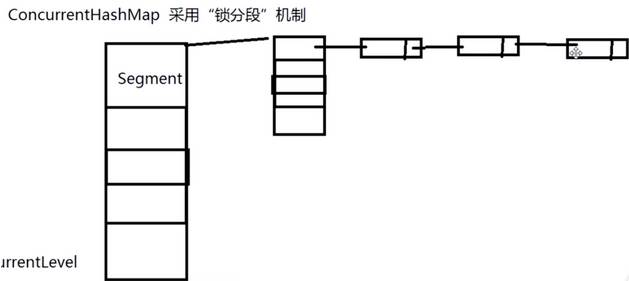

## 集合类是怎么解决高并发中的问题？

思路 先说一下那些是非安全

​      普通的安全的集合类

​      JUC中高并发的集合类

线程非安全的集合类 ArrayList LinkedList HashSet TreeSet HashMap TreeMap 实际开发中我们自己用这样的集合最多,因为一般我们自己写的业务代码中,不太涉及到多线程共享同一个集合的问题

线程安全的集合类 Vector HashTable 虽然效率没有JUC中的高性能集合高,但是也能够适应大部分环境

高性能线程安全的集合类

 1.ConcurrentHashMap 

 2.ConcurrentHashMap和HashTable的区别

 3.ConcurrentHashMap线程安全的具体实现方式/底层具体实现 

 4.说说CopyOnWriteArrayList

 

ConcurrentHashMap

java5.0在juc包中提供了大量支持并发的容器类，采用“锁分段”机制，Concurrentlevel分段级别，默认16，就是有16个段（segment)，每个段默认又有16个哈希表（table），每个又有链表连着。

在JDK1.7的时候，ConcurrentHashMap（分段锁） 对整个桶数组进行了分割分段(Segment)，每一把锁只锁容器其中一部分数据，多线程访问容器里不同数据段的数据，就不会存在锁竞争。
 DK1.8ConcurrentHashMap取消了Segment分段锁，采用CAS和synchronized来保证并发安全。数据结构跟HashMap1.8的结构类似，数组+链表/红黑二叉树。Java 8在链表长度超过一定阈值（8）时将链表（寻址时间复杂度为O(N)）转换为红黑树（寻址时间复杂度为O(log(N))）
 synchronized只锁定当前链表或红黑二叉树的首节点，这样只要hash不冲突，就不会产生并发，效率又提升N倍。

 

ConcurrentSkipListMap是**线程安全的有序的哈希表(相当于线程安全的TreeMap)**; 它**继承于AbstractMap类，并且实现ConcurrentNavigableMap接口**。ConcurrentSkipListMap是**通过“跳表”来实现的**，

ConcurrentSkipListSet是**线程安全的有序的集合(相当于线程安全的TreeSet)**；**它继承于AbstractSet，并实现了NavigableSet接口**。ConcurrentSkipListSet是通过ConcurrentSkipListMap实现的，它也支持并发。

 CopyOnWriteArraySet addIfAbsent和 CopyOnWriteArrayList（写入并复制）也是juc里面的，它解决了并发修改异常，每当有写入的时候，就在底层重新复制一个新容器写入，最后把新容器的引用地址赋给旧的容器，在别人写入的时候，其他线程读数据，依然是旧容器的线程。这样是开销很大的，所以不适合频繁写入的操作。适合并发迭代操作多的场景。只能保证数据的最终一致性