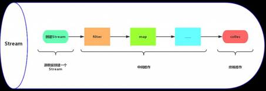
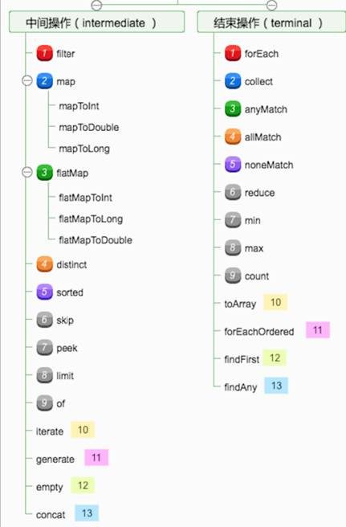

## Jdk1.8中的stream有用过吗，详述一下stream的并行操作原理？stream并行的线程池是从哪里来的？

Stream作为Java8的一大亮点，它与java.io包里的InputStream和OutputStream是完全不同的概念。它是对容器对象功能的增强，它专注于对容器对象进行各种非常便利、高效的聚合操作或者大批量数据操作。

Stream API借助于同样新出现的Lambda表达式，极大的提高编程效率和程序可读性。同时，它提供串行和并行两种模式进行汇聚操作，并发模式能够充分利用多核处理器的优势，使用fork/join并行方式来拆分任务和加速处理过程。所以说，Java8中首次出现的 java.util.stream是一个函数式语言+多核时代综合影响的产物。

Stream有如下三个操作步骤：

一、创建Stream：从一个数据源，如集合、数组中获取流。

二、中间操作：一个操作的中间链，对数据源的数据进行操作。

三、终止操作：一个终止操作，执行中间操作链，并产生结果。

 

 

当数据源中的数据上了流水线后，这个过程对数据进行的所有操作都称为“中间操作”。中间操作仍然会返回一个流对象，因此多个中间操作可以串连起来形成一个流水线。比如map (mapToInt, flatMap 等)、filter、distinct、sorted、peek、limit、skip、parallel、sequential、unordered。

当所有的中间操作完成后，若要将数据从流水线上拿下来，则需要执行终止操作。终止操作将返回一个执行结果，这就是你想要的数据。比如：forEach、forEachOrdered、toArray、reduce、collect、min、max、count、anyMatch、allMatch、noneMatch、findFirst、findAny、iterator。

多个中间操作可以连接起来形成一个流水线，除非流水线上触发终止操作，否则中间操作不会执行任何处理！而在终止操作时一次性全部处理，称作“惰性求值”。

stream并行原理: 其实本质上就是在ForkJoin上进行了一层封装，将Stream 不断尝试分解成更小的split，然后使用fork/join 框架分而治之, parallize使用了默认的ForkJoinPool.common 默认的一个静态线程池.