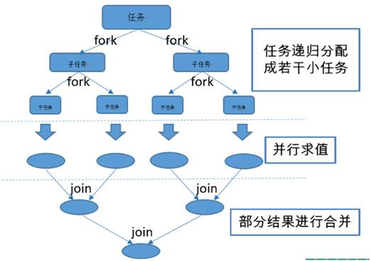
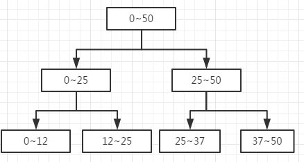
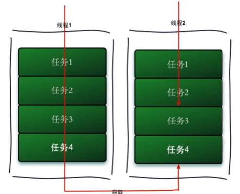

## 什么是ForkJoin框架 适用场景

虽然目前处理器核心数已经发展到很大数目，但是按任务并发处理并不能完全充分的利用处理器资源，因为一般的应用程序没有那么多的并发处理任务。基于这种现状，考虑把一个任务拆分成多个单元，每个单元分别得到执行，最后合并每个单元的结果。 

Fork/Join框架是JAVA7提供的一个用于并行执行任务的框架，是一个把大任务分割成若干小任务，最终汇总每个小任务结果得到大任务结果的框架。 

 

**2. 工作窃取算法（work-stealing）** 

一个大任务拆分成多个小任务，为了减少线程间的竞争，把这些子任务分别放到不同的队列中，并且每个队列都有单独的线程来执行队列里的任务，线程和队列一一对应。 

但是会出现这样一种情况：A线程处理完了自己队列的任务，B线程的队列里还有很多任务要处理。 

A是一个很热情的线程，想过去帮忙，但是如果两个线程访问同一个队列，会产生竞争，所以A想了一个办法，从双端队列的尾部拿任务执行。而B线程永远是从双端队列的头部拿任务执行。 

 

注意：线程池中的每个线程都有自己的工作队列（PS，这一点和ThreadPoolExecutor不同，ThreadPoolExecutor是所有线程公用一个工作队列，所有线程都从这个工作队列中取任务），当自己队列中的任务都完成以后，会从其它线程的工作队列中偷一个任务执行，这样可以充分利用资源。 

 

**工作窃取算法的优点：** 

​     利用了线程进行并行计算，减少了线程间的竞争。 

**工作窃取算法的缺点：** 

​     任务争夺问题